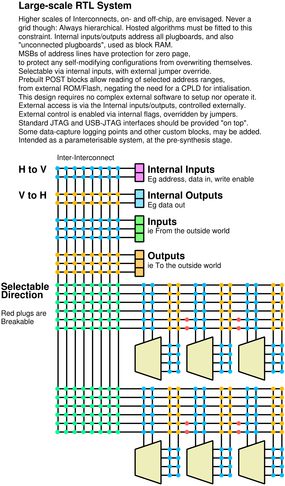

# FPGA^2
An OSHW (Open-Source Hardware) FPGA (Field-Programmable Gate Array), initially running in its own online circuit simulator.


This operates under the [CERN-OHL-P licence](https://github.com/RobinHodson/FPGA/blob/main/LICENSE.txt).

The first online presence for this project, is/was [freedom.is/svg](http://freedom.is/svg)

## Status

* Currently converting parts of the original website into documentation here.
* Developing a new tool to generate complex SVG faster.

The previous slow generation of SVG diagrams, held up this documenting process for a while.

## Contents

[Main documentation](https://robinhodson.github.io/FPGA/), experimentally also merged into this readme:

<details><summary><A href="https://robinhodson.github.io/FPGA/explain.html">Explanations</A></summary>
<UL>
<LI><A href="https://robinhodson.github.io/FPGA/explain.html#intro">Introduction</A>
<LI><A href="https://robinhodson.github.io/FPGA/explain.html#what">What this is</A>
<LI><A href="https://robinhodson.github.io/FPGA/explain.html#why">Why &amp; how this was developed</A>
<LI><A href="https://robinhodson.github.io/FPGA/explain.html#associated">Associated Projects</A>
</UL>
</details>  
<details><summary><A href="https://robinhodson.github.io/FPGA/design.html">Improved FPGA</A></summary>
<UL>
<LI><A href="https://robinhodson.github.io/FPGA/design.html#key">Circuit Symbols (Key)</A>
<LI><A href="https://robinhodson.github.io/FPGA/design.html#examples">Circuit Examples</A>
<LI><A href="https://robinhodson.github.io/FPGA/design.html#design">FPGA Design</A>
<LI><A href="https://robinhodson.github.io/FPGA/design.html#advantages">Advantages</A>
</UL>
</details>  
<details><summary><A href="https://robinhodson.github.io/FPGA/algebra.html">Extended Boolean Algebra</A></summary>
<UL>
<LI><A href="https://robinhodson.github.io/FPGA/algebra.html#objectives">Outline &amp; Objectives</A>
<LI><A href="https://robinhodson.github.io/FPGA/algebra.html#groundwork">Groundwork</A>
<LI><A href="https://robinhodson.github.io/FPGA/algebra.html#higher">Higher-order Functions</A>
<LI><A href="https://robinhodson.github.io/FPGA/algebra.html#conclusions">Equivalents &amp; Conclusions</A>
</UL>
</details>
<details><summary><A href="https://robinhodson.github.io/FPGA/roadmap.html">Roadmap</A></summary>
<UL>
<LI><A href="https://robinhodson.github.io/FPGA/roadmap.html#history">Potted History</A>
<LI><A href="https://robinhodson.github.io/FPGA/roadmap.html#bottlenecks">Bottlenecks &amp; Workarounds</A>
<LI><A href="https://robinhodson.github.io/FPGA/roadmap.html#conclusions">Conclusions along the way</A>
<LI><A href="https://robinhodson.github.io/FPGA/roadmap.html#future">Future Plans</A>
</UL>
</details>

## Quick Overview

<details>
<summary>Verilog syntax highlighting test</summary>

```verilog
module Example_counter
#(parameter WIDTH=64,NAME="world")
(input clk,
 output reg [WIDTH-1:0] q);
...
```

(The above code has nothing to do with this project.)
</details>
<details>
<summary>Large-scale RTL plan/explanation of my FPGA design</summary>
(Added 23/5/2023)



You can also [download this as a PDF](https://github.com/RobinHodson/FPGA/blob/main/docs/rtl1b.pdf): Click on the download rawfile button.
</details>
